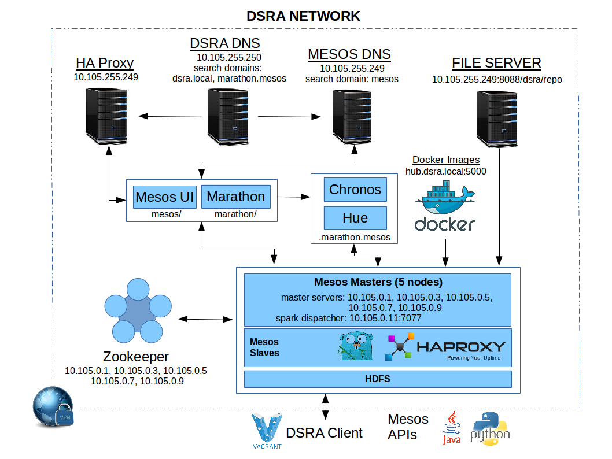

## Data Science Research Architecture, Data Center OS

### Overview

The newest version of the DSRA migrates the system to a Mesos-centric architecture. It provides 
significant distributed processing capabilities out of the box, supporting a variety of 
distributed frameworks. The distributed processing architecture has been abstracted for Engineers to 
develop their own frameworks in a wide-range of programming languages, including Java, Python, Ruby, 
C, and Go. Additional system information and examples are detailed in the [wiki](https://github.com/aglahe/dsra-dcos/wiki). 

### Future Releases

Mesos also supports deploying applications as Docker containers. Long running processes are
managed by Marathon, which can run commands across the Mesos cluster, containers deployed 
from public repoitories, like DockerHub, or it can use an organization's private Docker registry.

Distributed storage is supported in the first software release, utilizing HDFS. 

Future releases and updates will focus on adding more software capabilities, to include, but not limited too, the following:

* ElasticSearch
* Kafka
* HBase
* Myriad/Yarn
* Mongo
* HDFS (Federated)
* Security

### License

DSRA DCOS is licensed under the [Apache 2 License](http://www.apache.org/licenses/LICENSE-2.0)

